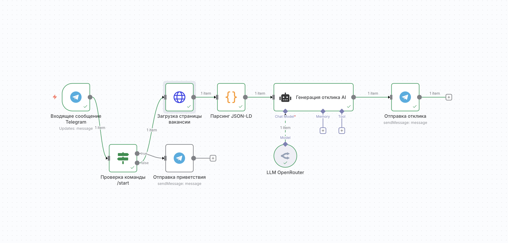

## CV Bot — AI помічник для відгуків на вакансії (n8n)

Легкий n8n‑воркфлоу для створення персоналізованих відгуків на вакансії з Telegram. Користувач надсилає посилання на вакансію, бот завантажує сторінку, витягує JSON‑LD, формує короткий відгук українською і надсилає в чат.

### Можливості
- **Аналіз вакансії за посиланням** (djinni.co, work.ua, robota.ua тощо)
- **Автогенерація відгуку (100–150 слів)** українською
- **Інтеграція з Telegram**: тригер і відправка повідомлень
- **LLM через OpenRouter**: модель `moonshotai/kimi-k2:free`

### Що всередині
- Файл воркфлоу: `CV Bot - AI помощник для откликов на вакансии.json`
- Вузли:
  - `Входящее сообщение Telegram` — отримує повідомлення від користувача
  - `Проверка команды /start` — обробляє команду `/start`
  - `Загрузка страницы вакансии` — завантажує HTML сторінки вакансії
  - `Парсинг JSON-LD` — витягує JSON‑LD і нормалізує поля (title, company, description, salary)
  - `Генерация отклика AI` + `LLM OpenRouter` — формує відгук
  - `Отправка приветствия` і `Отправка отклика` — відправлення повідомлень у Telegram

### Вимоги
- Розгорнутий `n8n` (Docker або локально)
- Токен Telegram‑бота (BotFather)
- Ключ OpenRouter (`OPENROUTER_API_KEY`)

### Налаштування кредів у n8n
1. **Telegram**
   - Створіть бота через BotFather, отримайте токен.
   - У n8n відкрийте Credentials → створіть `Telegram API` creds.
   - Назвіть їх так само, як у воркфлоу: `@quick_applybot` (або змініть посилання в вузлах на свої креденшали).

2. **OpenRouter**
   - Отримайте ключ на `https://openrouter.ai`
   - У n8n створіть creds `OpenRouter API` та вставте ключ.
   - В узлі `LLM OpenRouter` переконайтеся, що підключені ваші creds.

### Імпорт воркфлоу
- n8n → Workflows → Import from file → оберіть `CV Bot - AI помощник для откликов на вакансии.json`
- Відкрийте воркфлоу та прив’яжіть свої креденшали до вузлів `Telegram` і `OpenRouter`.

### Важливо: безпека
- У файлі немає токенів/ключів — лише посилання на креденшали n8n.
- У вузлі `Загрузка страницы вакансии` заголовки `Cookie` видалено. Якщо будете редагувати заголовки — не додавайте `Cookie`/`cookie`, вони не потрібні для публічних вакансій.

### Як користуватись
- Активуйте воркфлоу (Activate).
- У Telegram:
  - Надішліть `/start` — бот пришле інструкції.
  - Надішліть посилання на вакансію — отримаєте готовий відгук.

### Налаштування моделі
- За замовчуванням використовується `moonshotai/kimi-k2:free` через OpenRouter.
- Можна змінити модель у вузлі `LLM OpenRouter`.

### Типові проблеми
- **Бот не відповідає**: перевірте активність воркфлоу, коректність Telegram‑токена і Webhook у n8n.
- **Порожня відповідь**: сторінка не містить JSON‑LD або сайт захищений. Спробуйте інше посилання.
- **Помилки LLM**: перевірте ліміти/баланс OpenRouter, підключення кредів, назву моделі.

### Структура
- `CV Bot - AI помощник для откликов на вакансии.json` — основний воркфлоу
- `README.md` — інструкція

### Ліцензія
MIT (за вашим вибором).

---

## CV Bot — AI помощник для откликов на вакансии (n8n)

Легкий n8n‑воркфлоу для создания персонализированных откликов на вакансии из Telegram. Пользователь присылает ссылку на вакансию, бот загружает страницу, извлекает JSON‑LD, формирует краткий отклик на украинском и отправляет в чат.

### Возможности
- **Анализ вакансии по ссылке** (djinni.co, work.ua, robota.ua и др.)
- **Автогенерация отклика (100–150 слов)** на украинском
- **Интеграция с Telegram**: триггер и отправка сообщений
- **LLM через OpenRouter**: модель `moonshotai/kimi-k2:free`

### Что внутри
- Файл воркфлоу: `CV Bot - AI помощник для откликов на вакансии.json`
- Узлы:
  - `Входящее сообщение Telegram` — получает сообщения от пользователя
  - `Проверка команды /start` — обрабатывает `/start`
  - `Загрузка страницы вакансии` — загружает HTML страницы вакансии
  - `Парсинг JSON-LD` — извлекает JSON‑LD и нормализует поля (title, company, description, salary)
  - `Генерация отклика AI` + `LLM OpenRouter` — формирует отклик
  - `Отправка приветствия` и `Отправка отклика` — отправка сообщений в Telegram

### Требования
- Развернутый `n8n` (Docker или локально)
- Токен Telegram‑бота (BotFather)
- Ключ OpenRouter (`OPENROUTER_API_KEY`)

### Настройка кредов в n8n
1. **Telegram**
   - Создайте бота через BotFather, получите токен.
   - В n8n откройте Credentials → создайте `Telegram API` creds.
   - Назовите их так же, как в воркфлоу: `@quick_applybot` (или переименуйте ссылки в узлах на свои креды).

2. **OpenRouter**
   - Получите ключ на `https://openrouter.ai`
   - В n8n создайте creds `OpenRouter API` и вставьте ключ.
   - В узле `LLM OpenRouter` убедитесь, что подключены ваши creds.

### Импорт воркфлоу
- n8n → Workflows → Import from file → выберите `CV Bot - AI помощник для откликов на вакансии.json`
- Откройте воркфлоу и привяжите свои креды к узлам `Telegram` и `OpenRouter`.

### Важно: безопасность
- В файле нет токенов/ключей — только ссылки на креды n8n.
- В узле `Загрузка страницы вакансии` заголовки `Cookie` удалены. Если будете редактировать заголовки — не добавляйте `Cookie`/`cookie`, они не нужны для публичных вакансий.

### Как пользоваться
- Активируйте воркфлоу (Activate).
- В Telegram:
  - Отправьте `/start` — бот пришлет инструкции.
  - Пришлите ссылку на вакансию — получите готовый отклик.

### Настройки модели
- По умолчанию используется `moonshotai/kimi-k2:free` через OpenRouter.
- Модель можно сменить в узле `LLM OpenRouter`.

### Типичные проблемы
- **Бот не отвечает**: проверьте активность воркфлоу, корректность Telegram‑токена и Webhook у n8n.
- **Пустой ответ**: страница не содержит JSON‑LD или сайт защищен. Попробуйте другую ссылку.
- **Ошибки LLM**: проверьте лимиты/баланс OpenRouter, подключение кредов, название модели.

### Структура
- `CV Bot - AI помощник для откликов на вакансии.json` — основной воркфлоу
- `README.md` — инструкция

### Лицензия
MIT
